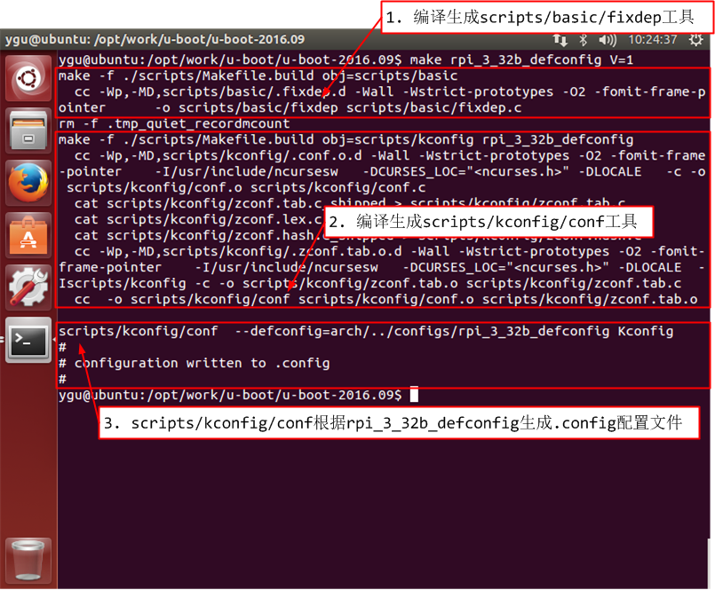
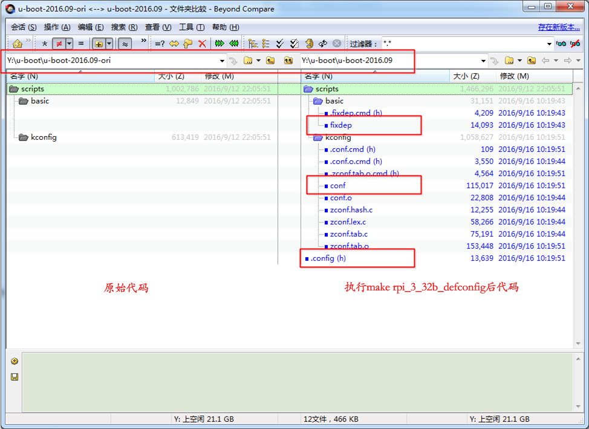
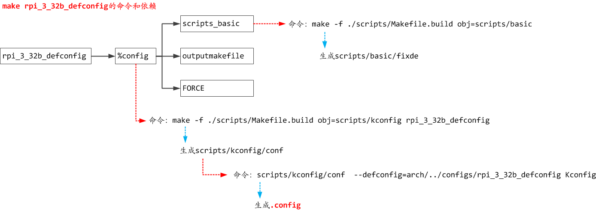

<head><meta charset="UTF-8"></head>
<style>
h1 {
    text-align: center;
    border-left: 5px solid #e86422;
    border-right: 5px solid #e86422;
}
h2 {
    border-left: 5px solid #ff7f00;
    border-right: 5px solid #ff7f00;
    padding-left: 10px;
}
h3 {
    border-left: 5px solid #e86422;
    padding-left: 8px;
}
h4 {
    border-left: 3px solid #f0a000;
    padding-left: 5px;
}
</style>

# U-Boot-2016.09 make 配置过程分析

本文转载自: [u-boot-2016.09 make配置过程分析](https://blog.csdn.net/guyongqiangx/article/details/52558087)

## 概述

本文基于 U-Boot 树莓派 3 代配置过程进行分析，环境如下：
编译环境：`Ubuntu 14.04 LTS`
编译工具：`arm-linux-gnueabi-gcc`
代码版本：`U-Boot v2016.09`
配置文件：`rpi_3_32b_defconfig`

U-Boot 自 v2014.10 版本开始引入 KBuild 系统，Makefile 的管理和组织跟以前版本的代码有了很大的不同，其 Makefile 更加复杂。整个 Makefile 中，嵌套了很多其它不同用途的 Makefile，各种目标和依赖也很多，make分析很容易陷进去，让人摸不着头脑。

本文涉及的配置命令： `make rpi_3_32b_defconfig`

## 实例执行配置命令

U-Boot 的编译跟 kernel 编译一样，分两步执行：
- 第一步：配置，执行 `make xxx_defconfig` 进行各项配置，生成 `.config` 文件
- 第二步：编译，执行 `make` 进行编译，生成可执行的二进制文件 `u-boot.bin `或 `u-boot.elf`

先从简单的 `make defconfig` 配置过程着手吧。
命令行输入： `make rpi_3_32b_defconfig V=1`

编译输出如下：


配置命令参数说明：
- `rpi_3_32b_defconfig` 是树莓派 3 代 32 位编译的配置文件
- `V=1` 指示编译显示详细的输出。默认 `V=0`，编译仅显示必要的简略信息

从输出的 log 看，`make rpi_3_32b_defconfig` 的执行主要分为 3 个部分，见图上的标示：
1. 执行 `make -f ./scripts/Makefile.build obj=scripts/basic`，编译生成 `scripts/basic/fixdep` 工具
2. 执行 `make -f ./scripts/Makefile.build obj=scripts/kconfig rpi_3_32b_defconfig` 编译生成 `scripts/kconfig/conf` 工具
3. 执行 `scripts/kconfig/conf --defconfig=arch/../configs/rpi_3_32b_defconfig Kconfig` 生成最终的 `.config` 配置文件

跟原始的代码相比，执行 `make rpi_3_32b_defconfig` 后文件夹内容的变化如下：


被后续编译用到的文件是.config。

## 详细配置流程分析

言归正传，整个配置流程的目的就是为了生成 `.config` 文件，下面详细分析 `.config` 文件是如何一步一步生成的。

Makefile 的核心是依赖和命令。对于每个目标，首先会检查依赖，如果依赖存在，则执行命令更新目标；如果依赖不存在，则会以依赖为目标，先生成依赖，待依赖生成后，再执行命令生成目标。
### 顶层make defconfig规则

执行 `make xxx_defconfig` 命令时，U-Boot 根目录下的 Makefile 中有唯一的规则匹配目标：
```
%config: scripts_basic outputmakefile FORCE
    $(Q)$(MAKE) $(build)=scripts/kconfig $@
```

对于目标 `rpi_3_32b_defconfig`，展开则有：
```
rpi_3_32b_defconfig: scripts_basic outputmakefile FORCE
    $(Q)$(MAKE) $(build)=scripts/kconfig rpi_3_32b_defconfig
```

其中$(build)在kbuild.include中定义：
```
build := -f $(srctree)/scripts/Makefile.build obj
```

**i. 依赖scripts_basic**

依赖scripts_basic：
```
# Basic helpers built in scripts/
PHONY += scripts_basic
scripts_basic:
    $(Q)$(MAKE) $(build)=scripts/basic
    $(Q)rm -f .tmp_quiet_recordmcount
```

可见scripts_basic没有进一步的依赖，展开后规则如下：
```
scripts_basic:
    $(Q) make -f ./scripts/Makefile.build obj=scripts/basic
    $(Q) rm -f .tmp_quiet_recordmcount
```

**ii. 依赖outputmakefile**

依赖outputmakefile：
```
PHONY += outputmakefile
# outputmakefile generates a Makefile in the output directory, if using a
# separate output directory. This allows convenient use of make in the
# output directory.
outputmakefile:
ifneq ($(KBUILD_SRC),)
    $(Q)ln -fsn $(srctree) source
    $(Q)$(CONFIG_SHELL) $(srctree)/scripts/mkmakefile \
        $(srctree) $(objtree) $(VERSION) $(PATCHLEVEL)
endif
```

outputmakefile也没有进一步的依赖。
如果执行如下命令：
```
make rpi_3_32b_defconfig O=out
```

那么所有生成的目标都将放到out目录，此时会通过outputmakefile导出一个makefile到out目录进行编译。

由于在当前目录下编译，$(KBUILD_SRC)为空，不需要导出makefile文件，outputmakefile为空目标。

**iii. 依赖FORCE**

依赖FORCE:
```
PHONY += FORCE
FORCE:
```

FORCE被定义为一个空目标。
如果一个目标添加FORCE依赖，每次编译都会去先去执行 FORCE（实际上什么都不做），然后运行命令更新目标，这样就能确保目标每次都会被更新。在这里也就保证目标 `rpi_3_32b_defconfig` 的命令：
```
$(Q)$(MAKE) $(build)=scripts/kconfig rpi_3_32b_defconfig
```
总是能够被执行。

以上是 `rpi_3_32b_defconfig` 的所有依赖，分析完依赖后再分析命令。

### 顶层make defconfig的命令
**i. 依赖scripts_basic的命令**

目标 `rpi_3_32b_defconfig` 的三个依赖 `scripts_basi`，`outputmakefile` 和 `FORCE` 中，只有scripts_basic需要执行命令，如下
```
scripts_basic:
    $(Q) make -f ./scripts/Makefile.build obj=scripts/basic
    $(Q) rm -f .tmp_quiet_recordmcount
```

然后 Make 命令会转到文件 `scripts/Makefile.build` 去执行。

*第一次调用 `scripts/Makefile.build` 进行编译*

文件 `script/Makefile.build` 的开头会根据传入的 `obj=scripts/basic` 参数设置 `src=scripts/basic`:
```
prefix := tpl
src := $(patsubst $(prefix)/%,%,$(obj))
ifeq ($(obj),$(src))
prefix := spl
src := $(patsubst $(prefix)/%,%,$(obj))
ifeq ($(obj),$(src))
prefix := .
endif
endif
```

然后搜寻 `$(srctree)/$(src)` 子目录下的 Makefile，并包含进来：
```
# The filename Kbuild has precedence over Makefile
kbuild-dir := $(if $(filter /%,$(src)),$(src),$(srctree)/$(src))
kbuild-file := $(if $(wildcard $(kbuild-dir)/Kbuild),$(kbuild-dir)/Kbuild,$(kbuild-dir)/Makefile)
include $(kbuild-file)
```

这里展开替换后相当于：
```
include ./scripts/basic/Makefile
```

文件 `scripts/basic/Makefile` 中定义了编译在主机上执行的工具 fixdep：
```
hostprogs-y := fixdep
always      := $(hostprogs-y)

# fixdep is needed to compile other host programs
$(addprefix $(obj)/,$(filter-out fixdep,$(always))): $(obj)/fixdep
```

工具 fixdep 用于更新每一个生成目标的依赖文件 `*.cmd`

上面定义的这个 `$(always)` 在 `scripts/Makefile.build` 里会被添加到 `targets` 中：
```
targets += $(extra-y) $(MAKECMDGOALS) $(always)
```

关于如何编译主机上可执行的程序，会在另外的文章中分析。

简而言之，scripts_basic 规则
```
scripts_basic:
    $(Q) make -f ./scripts/Makefile.build obj=scripts/basic
```

的最终结果就是编译 `scripts/basic/fixdep.c` 生成主机上的可执行文件 fixdep。至于为什么要编译 fixdep 和如何使用 fixdep，会在另外的文章中分析。
**ii. 顶层 rpi_3_32b_defconfig 的命令**

完成对依赖 `scripts_basic` 的更新后，接下来就是执行顶层目标的命令完成对 `rpi_3_32b_defconfig` 的更新，展开后的规则如下：
```
rpi_3_32b_defconfig: scripts_basic outputmakefile FORCE
    make -f ./scripts/Makefile.build obj= scripts/kconfig rpi_3_32b_defconfig
```

其中 `$(build)` 在 kbuild.include 中定义：
```
###
# Shorthand for $(Q)$(MAKE) -f scripts/Makefile.build obj=
# Usage:
# $(Q)$(MAKE) $(build)=dir
build := -f $(srctree)/scripts/Makefile.build obj
```

这个 make 命令会第二次转到 `scripts/Makefile.build` 去执行。

*第二次调用 scripts/Makefile.build 进行编译*

文件 `script/Makefile.build` 的开头会根据传入的 `obj=scripts/kconfig` 参数设置 `src=scripts/kconfig`。然后搜寻 `$(srctree)/$(src)` 子目录下的 Makefile，由于 `src=scripts/kconfig` 参数不同于第一次调用的参数（`src=scripts/basic`），此处包含的 Makefile 也不同于第一次的 Makefile 了：
```
# The filename Kbuild has precedence over Makefile
kbuild-dir := $(if $(filter /%,$(src)),$(src),$(srctree)/$(src))
kbuild-file := $(if $(wildcard $(kbuild-dir)/Kbuild),$(kbuild-dir)/Kbuild,$(kbuild-dir)/Makefile)
include $(kbuild-file)
```

这里替换展开后相当于：
```
include ./scripts/kconfig/Makefile
```

文件 `scripts/kconfig/Makefile` 中定义了所有匹配 `%config` 的目标：
```
PHONY += xconfig gconfig menuconfig config silentoldconfig update-po-config \
    localmodconfig localyesconfig

PHONY += oldnoconfig savedefconfig defconfig

PHONY += kvmconfig

PHONY += tinyconfig
```

对于这里传入的 `rpi_3_32b_defconfig`，匹配的目标是：
```
%_defconfig: $(obj)/conf
    $(Q)$< $(silent) --defconfig=arch/$(SRCARCH)/configs/$@ $(Kconfig)
```

展开为：
```
rpi_3_32b_defconfig: scripts/kconfig/conf
    $(Q)scripts/kconfig/conf  --defconfig=arch/../configs/rpi_3_32b_defconfig Kconfig
```

此处目标 `rpi_3_32b_defconfig` 依赖于 `scripts/kconfig/conf`，接下来检查并生成依赖。
```
hostprogs-y := conf nconf mconf kxgettext qconf gconf
```

`hostprogs-y` 指出 conf 被定义为主机上执行的程序，其依赖于另外两个文件：
```
conf-objs   := conf.o  zconf.tab.o
```

通过编译 `conf.c` 和 `zconf.tab.c` 生成 `conf-objs`，并链接为 `scripts/kconfig/conf`

生成依赖后就是执行目标的命令了：
```
$(Q)scripts/kconfig/conf  --defconfig=arch/../configs/rpi_3_32b_defconfig Kconfig
```

工具 `scripts/kconfig/conf` 的操作会在单独的文章中分析，此处只做简要的说明：

conf 工具从根目录下开始树状读取默认的 Kconfig 文件，分析其配置并保存在内存中。分析完默认的 Kconfig 后再读取指定文件（即 `arch/../configs/rpi_3_32b_defconfig`）更新得到最终的符号表，并输出到 `.config` 文件中。

至此完成了 `make rpi_3_32b_defconfig` 执行配置涉及的所有依赖和命令的分析。

### make defconfig 配置流程简图

整个配置流程阐述得比较啰嗦，可以用一个简单的依赖图表示，如下：


（可以将图片拖到浏览器的其他窗口看大图）
