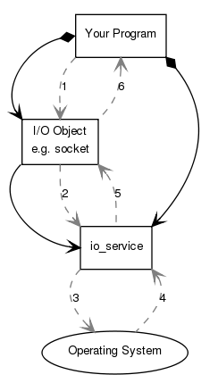
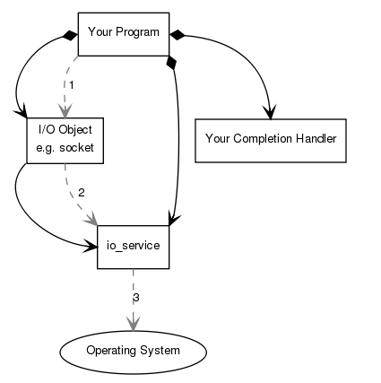
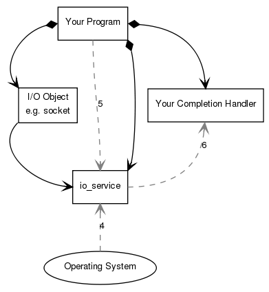

<head><meta charset="UTF-8"></head>
<style>
h1 {
    text-align: center;
    border-left: 5px solid #e86422;
    border-right: 5px solid #e86422;
}
h2 {
    border-left: 5px solid #ff7f00;
    border-right: 5px solid #ff7f00;
    padding-left: 10px;
}
h3 {
    border-left: 5px solid #e86422;
    padding-left: 8px;
}
h4 {
    border-left: 3px solid #f0a000;
    padding-left: 5px;
}
</style>

参考至 [Boost.Asio 1.66](https://www.boost.org/doc/libs/1_66_0/doc/html/boost_asio.html)

# Boost之Asio —— 总览

## 原理解析
Boost.Asio 用来实现 同步/异步 的 I/O 操作，比如套接字、定时器、串口等等。在使用 Boost.Asio 之前，我们需要对其各部分有个整体的了解。
那么Asio 以及你的程序是怎样协同工作的

#### 同步connect
作为一个例子，我们来分析一下一个套接字的同步connect操作时发生了什么

每个 Asio 程序都至少有一个 **io_context** 对象(io_context 在 Boost 1.66 之前一直叫 **io_service**)，它会把你的程序与系统的I/O服务连接起来
> boost::asio::io_context io_context;

执行 I/O 操作，你的程序需要一个 **I/O 对象**，比如TCP套接字。所有 I/O 对象都依赖于 io_context，一般在构造时指定
> boost::asio::ip::tcp::socket socket(io_context);

执行同步connect时，会发生如下事件:
1. 通过 I/O 对象来初始化 connect 操作
> socket.connect(server_endpoint);

2. I/O 对象把请求转发给 io_context
3. io_context 调用操作系统来执行连接操作
4. 操作系统把处理结果返回给 io_context
5. io_context 把系统错误转换成  **boost::system::error_code** 对象。一个 error_code 对象可以用来与特定值比较，亦或用来检测 boolean，发生异常则为 true。最终结果会返回给 I/O 对象
6. 如果操作失败， I/O 对象会**抛出 boost::system::system_error 异常**。当然如果你不想 I/O 对象抛出异常，可以这样做
> boost::system::error_code ec;
> socket.connect(server_endpoint, ec);

#### 异步connect
异步 connect 时，有着不同的处理流程

1. 通过 I/O 对象来初始化 connect 操作
> void your_completion_handler(const boost::system::error_code& ec);
> socket.async_connect(server_endpoint, your_completion_handler);

2. I/O 对象把请求转发给 io_context
3. io_context 给操作系统发信号，通知它应该开始一个异步 connect
一段时间之后

4. **connect 操作完成之后，操作系统会把结果放入一个队列，准备被 io_context 取出**
5. **你必须调用 io_context::run() (或者类似的函数) 来获取结果**。**如果这里还有未完成的异步操作， io_context::run() 会被阻塞**。一般情况，你应该在开始你第一个异步操作之后尽快调用 io_context::run()
6. 在io_context::run() 中，io_context 会把操作结果出队，并将其转换成一个 error_code，然后将其传递给 **Your Completion Handler**


## Streams, Short Reads and Short Writes
大多 Boost.Asio 中的 I/O 对象都是面向流的，这就意味着:
- 没有信息界限。被传输的数据是连续的数据队列
- 读写操作所传输的数据可能比要求的少。这被称为**短读或短写**(short read or short write)
- 对于面向流的 I/O 对象，我们通常使用如下成员函数进行操作: **read_some(), async_read_some(), write_some(), async_write_some()**

## TCP，UDP and ICMP
#### TCP Clients
使用一个 **resolver** 来作**域名解析**，我们提供域名和服务名， resolver 会将其转化为一个或多个 endpoints
```
ip::tcp::resolver resolver(my_io_context);
ip::tcp::resolver::query query("www.boost.org", "http");
ip::tcp::resolver::iterator iter = resolver.resolve(query);
ip::tcp::resolver::iterator end; // default constructed object can be used as an end iterator
while (iter != end)
{
    ip::tcp::endpoint endpoint = *iter++;
    std::cout << endpoint << std::endl;
}
```
如上 endpoint 列表中包含了 IPv4 和 IPv6 的 endpoint，需要手动检查
也可以作一些限定
> ip::tcp::resolver::query query(ip::tcp::v4(), "www.boost.org", "http");
> **ip::tcp::resolver::iterator iter = resolver.resolve(ip::tcp::v4(), "www.boost.org", "http");**

为了在 connect 时，不用手动尝试每一个 endpoint，可以使用如下方式
```
ip::tcp::socket socket(my_io_context);
boost::asio::connect(socket, resolver.resolve(query));
```
这样操作会遍历 endpoint 列表，直到 connect 成功
对应的异步 connect 操作如下: 
```
boost::asio::async_connect(socket_, iter,
    boost::bind(&client::handle_connect, this,
      boost::asio::placeholders::error));

// ...

void handle_connect(const error_code& error)
{
  if (!error)
  {
    // Start read or write operations.
  }
  else
  {
    // Handle error.
  }
}
```
connect 指定的 endpoint ，执行如下操作:
```
ip::tcp::socket socket(my_io_context);
socket.connect(endpoint);
```

可以使用成员函数receive(), async_receive(), send(), async_send()来从已连接的 TCP 套接字读写数据。
然而为了防止短读或短写(short writes or reads)，应用程序一般使用read(), async_read(), write(), async_write()

#### TCP Servers
作为服务器，可以使用 **acceptor** 来接收即将到来的连接
```
ip::tcp::acceptor acceptor(my_io_context, my_endpoint);
...
ip::tcp::socket socket(my_io_context);
acceptor.accept(socket);
```
当一个套接字被成功接收之后，就可以像TCP Clients一样读写了

#### UDP
同样使用resolver进行域名解析:
```
ip::udp::resolver::query query("localhost", "daytime");
ip::udp::resolver::iterator iter = resolver.resolve(query);
...
```
一个UDP套接字一般会**绑定**到一个本地endpoint。下面的代码会创建一个 IP version 4 的UDP套接字，并将其绑定到12345端口， "any" 地址
```
ip::udp::endpoint endpoint(ip::udp::v4(), 12345);
ip::udp::socket socket(my_io_context, endpoint);
```
endpoint 还可以这样初始化:
> ip::udp::endpoint endpoint(ip::make_address("192.168.0.10"), 80);

绑定操作可以不在初始化时进行:
> ip::udp::socket socket(my_io_context);
> socket.bind(endpoint);

可以使用成员函数receive_from(), async_receive_from(), send_to(),  async_send_to()来读写未连接的UDP套接字。对于已连接的UDP套接字可以使用成员函数receive(), async_receive(), send(), async_send()

#### ICMP
同样使用resolver进行域名解析:
```
ip::icmp::resolver resolver(my_io_context);
ip::icmp::resolver::query query("localhost", "");
ip::icmp::resolver::iterator iter = resolver.resolve(query);
...
```

一个ICMP套接字可以绑定到一个本地endpoint。下面代码会创建一个IP version 6的ICMP套接字，并将其绑定到"any"地址
```
ip::icmp::endpoint endpoint(ip::icmp::v6(), 0);
ip::icmp::socket socket(my_io_context, endpoint);
```
**端口号并未使用**

可以使用成员函数receive_from(), async_receive_from(), send_to(), async_send_to()来读写未连接的ICMP套接字

## TCP 实践
前面杂七杂八的讲了一大堆，接下来再分析一个使用 TCP 实现的 daytime 协议。
代码是从 [这个地方](https://www.boost.org/doc/libs/1_66_0/doc/html/boost_asio/tutorial.html) 偷过来的，懒得自己写用例了

#### 同步 TCP daytime 客户端
```
//
// client.cpp
// ~~~~~~~~~~
//
// Copyright (c) 2003-2017 Christopher M. Kohlhoff (chris at kohlhoff dot com)
//
// Distributed under the Boost Software License, Version 1.0. (See accompanying
// file LICENSE_1_0.txt or copy at http://www.boost.org/LICENSE_1_0.txt)
//

#include <iostream>
#include <boost/array.hpp>
#include <boost/asio.hpp>

using boost::asio::ip::tcp;

int main(int argc, char* argv[])
{
  try
  {
    if (argc != 2)
    {
      std::cerr << "Usage: client <host>" << std::endl;
      return 1;
    }

    boost::asio::io_context io_context;

    tcp::resolver resolver(io_context);
    tcp::resolver::results_type endpoints =
      resolver.resolve(argv[1], "daytime");

    tcp::socket socket(io_context);
    boost::asio::connect(socket, endpoints);

    for (;;)
    {
      boost::array<char, 128> buf;
      boost::system::error_code error;

      size_t len = socket.read_some(boost::asio::buffer(buf), error);

      if (error == boost::asio::error::eof)
        break; // Connection closed cleanly by peer.
      else if (error)
        throw boost::system::system_error(error); // Some other error.

      std::cout.write(buf.data(), len);
    }
  }
  catch (std::exception& e)
  {
    std::cerr << e.what() << std::endl;
  }

  return 0;
}
```

使用如下命令编译: 
> g++ -std=c++11  ./client.cpp -o client  -lboost_system -lpthread

我们使用 boots::array 来保存数据。boost::asio::buffer() 函数会自动检测 array 的大小，防止越界。除了boost::array，我们还可以使用 char[], std::string, std::vector等

 ip::tcp::socket::read_some() 用来从流套接字中读取数据。此函数会阻塞，直到读取到数据或者产生错误。**boost::asio::error::eof 错误表示服务器断开连接**

#### 同步 TCP daytime 服务器
```
//
// server.cpp
// ~~~~~~~~~~
//
// Copyright (c) 2003-2017 Christopher M. Kohlhoff (chris at kohlhoff dot com)
//
// Distributed under the Boost Software License, Version 1.0. (See accompanying
// file LICENSE_1_0.txt or copy at http://www.boost.org/LICENSE_1_0.txt)
//

#include <ctime>
#include <iostream>
#include <string>
#include <boost/asio.hpp>

using boost::asio::ip::tcp;

std::string make_daytime_string()
{
  using namespace std; // For time_t, time and ctime;
  time_t now = time(0);
  return ctime(&now);
}

int main()
{
  try
  {
    boost::asio::io_context io_context;

    tcp::acceptor acceptor(io_context, tcp::endpoint(tcp::v4(), 13));

    for (;;)
    {
      tcp::socket socket(io_context);
      acceptor.accept(socket);

      std::string message = make_daytime_string();

      boost::system::error_code ignored_error;
      boost::asio::write(socket, boost::asio::buffer(message), ignored_error);
    }
  }
  catch (std::exception& e)
  {
    std::cerr << e.what() << std::endl;
  }

  return 0;
}
```

#### 异步 TCP daytime 服务器
```
//
// server.cpp
// ~~~~~~~~~~
//
// Copyright (c) 2003-2017 Christopher M. Kohlhoff (chris at kohlhoff dot com)
//
// Distributed under the Boost Software License, Version 1.0. (See accompanying
// file LICENSE_1_0.txt or copy at http://www.boost.org/LICENSE_1_0.txt)
//

#include <ctime>
#include <iostream>
#include <string>
#include <boost/bind.hpp>
#include <boost/shared_ptr.hpp>
#include <boost/enable_shared_from_this.hpp>
#include <boost/asio.hpp>

using boost::asio::ip::tcp;

std::string make_daytime_string()
{
  using namespace std; // For time_t, time and ctime;
  time_t now = time(0);
  return ctime(&now);
}

class tcp_connection
  : public boost::enable_shared_from_this<tcp_connection>
{
public:
  typedef boost::shared_ptr<tcp_connection> pointer;

  static pointer create(boost::asio::io_context& io_context)
  {
    return pointer(new tcp_connection(io_context));
  }

  tcp::socket& socket()
  {
    return socket_;
  }

  void start()
  {
    message_ = make_daytime_string();

    boost::asio::async_write(socket_, boost::asio::buffer(message_),
        boost::bind(&tcp_connection::handle_write, shared_from_this(),
          boost::asio::placeholders::error,
          boost::asio::placeholders::bytes_transferred));
  }

private:
  tcp_connection(boost::asio::io_context& io_context)
    : socket_(io_context)
  {
  }

  void handle_write(const boost::system::error_code& /*error*/,
      size_t /*bytes_transferred*/)
  {
  }

  tcp::socket socket_;
  std::string message_;
};

class tcp_server
{
public:
  tcp_server(boost::asio::io_context& io_context)
    : acceptor_(io_context, tcp::endpoint(tcp::v4(), 13))
  {
    start_accept();
  }

private:
  void start_accept()
  {
    tcp_connection::pointer new_connection =
      tcp_connection::create(acceptor_.get_executor().context());

    acceptor_.async_accept(new_connection->socket(),
        boost::bind(&tcp_server::handle_accept, this, new_connection,
          boost::asio::placeholders::error));
  }

  void handle_accept(tcp_connection::pointer new_connection,
      const boost::system::error_code& error)
  {
    if (!error)
    {
      new_connection->start();
    }

    start_accept();
  }

  tcp::acceptor acceptor_;
};

int main()
{
  try
  {
    boost::asio::io_context io_context;
    tcp_server server(io_context);
    io_context.run();
  }
  catch (std::exception& e)
  {
    std::cerr << e.what() << std::endl;
  }

  return 0;
}
```
异步好复杂。。。
先把代码贴在这儿吧，以后来研究


## UDP 实践

#### 同步 UDP daytime 客户端
```
//
// client.cpp
// ~~~~~~~~~~
//
// Copyright (c) 2003-2017 Christopher M. Kohlhoff (chris at kohlhoff dot com)
//
// Distributed under the Boost Software License, Version 1.0. (See accompanying
// file LICENSE_1_0.txt or copy at http://www.boost.org/LICENSE_1_0.txt)
//

#include <iostream>
#include <boost/array.hpp>
#include <boost/asio.hpp>

using boost::asio::ip::udp;

int main(int argc, char* argv[])
{
  try
  {
    if (argc != 2)
    {
      std::cerr << "Usage: client <host>" << std::endl;
      return 1;
    }

    boost::asio::io_context io_context;

    udp::resolver resolver(io_context);
    udp::endpoint receiver_endpoint =
      *resolver.resolve(udp::v4(), argv[1], "daytime").begin();

    udp::socket socket(io_context);
    socket.open(udp::v4());

    boost::array<char, 1> send_buf  = {{ 0 }};
    socket.send_to(boost::asio::buffer(send_buf), receiver_endpoint);

    boost::array<char, 128> recv_buf;
    udp::endpoint sender_endpoint;
    size_t len = socket.receive_from(
        boost::asio::buffer(recv_buf), sender_endpoint);

    std::cout.write(recv_buf.data(), len);
  }
  catch (std::exception& e)
  {
    std::cerr << e.what() << std::endl;
  }

  return 0;
}
```
**socket.open** 用于打开套接字并使用指定协议。
如果在初始化 socket 时指定协议或绑定 endpoint，则会自动打开套接字
connect 时也会自动打开套接字

**receive_from** 有三种形式
receive_from(buffer, sender_endpoint)
receive_from(buffer, sender_endpoint, flags)
receive_from(buffer, sender_endpoint, flags, error_coed)
**send_to** 与之类似

#### 同步 UDP daytime 服务器
```
//
// server.cpp
// ~~~~~~~~~~
//
// Copyright (c) 2003-2017 Christopher M. Kohlhoff (chris at kohlhoff dot com)
//
// Distributed under the Boost Software License, Version 1.0. (See accompanying
// file LICENSE_1_0.txt or copy at http://www.boost.org/LICENSE_1_0.txt)
//

#include <ctime>
#include <iostream>
#include <string>
#include <boost/array.hpp>
#include <boost/asio.hpp>

using boost::asio::ip::udp;

std::string make_daytime_string()
{
  using namespace std; // For time_t, time and ctime;
  time_t now = time(0);
  return ctime(&now);
}

int main()
{
  try
  {
    boost::asio::io_context io_context;

    udp::socket socket(io_context, udp::endpoint(udp::v4(), 13));

    for (;;)
    {
      boost::array<char, 1> recv_buf;
      udp::endpoint remote_endpoint;
      boost::system::error_code error;
      socket.receive_from(boost::asio::buffer(recv_buf),
          remote_endpoint, 0, error);

      if (error && error != boost::asio::error::message_size)
        throw boost::system::system_error(error);

      std::string message = make_daytime_string();

      boost::system::error_code ignored_error;
      socket.send_to(boost::asio::buffer(message),
          remote_endpoint, 0, ignored_error);
    }
  }
  catch (std::exception& e)
  {
    std::cerr << e.what() << std::endl;
  }

  return 0;
}
```

#### 异步 UDP daytime 服务器
```
//
// server.cpp
// ~~~~~~~~~~
//
// Copyright (c) 2003-2017 Christopher M. Kohlhoff (chris at kohlhoff dot com)
//
// Distributed under the Boost Software License, Version 1.0. (See accompanying
// file LICENSE_1_0.txt or copy at http://www.boost.org/LICENSE_1_0.txt)
//

#include <ctime>
#include <iostream>
#include <string>
#include <boost/array.hpp>
#include <boost/bind.hpp>
#include <boost/shared_ptr.hpp>
#include <boost/asio.hpp>

using boost::asio::ip::udp;

std::string make_daytime_string()
{
  using namespace std; // For time_t, time and ctime;
  time_t now = time(0);
  return ctime(&now);
}

class udp_server
{
public:
  udp_server(boost::asio::io_context& io_context)
    : socket_(io_context, udp::endpoint(udp::v4(), 13))
  {
    start_receive();
  }

private:
  void start_receive()
  {
    socket_.async_receive_from(
        boost::asio::buffer(recv_buffer_), remote_endpoint_,
        boost::bind(&udp_server::handle_receive, this,
          boost::asio::placeholders::error,
          boost::asio::placeholders::bytes_transferred));
  }

  void handle_receive(const boost::system::error_code& error,
      std::size_t /*bytes_transferred*/)
  {
    if (!error || error == boost::asio::error::message_size)
    {
      boost::shared_ptr<std::string> message(
          new std::string(make_daytime_string()));

      socket_.async_send_to(boost::asio::buffer(*message), remote_endpoint_,
          boost::bind(&udp_server::handle_send, this, message,
            boost::asio::placeholders::error,
            boost::asio::placeholders::bytes_transferred));

      start_receive();
    }
  }

  void handle_send(boost::shared_ptr<std::string> /*message*/,
      const boost::system::error_code& /*error*/,
      std::size_t /*bytes_transferred*/)
  {
  }

  udp::socket socket_;
  udp::endpoint remote_endpoint_;
  boost::array<char, 1> recv_buffer_;
};

int main()
{
  try
  {
    boost::asio::io_context io_context;
    udp_server server(io_context);
    io_context.run();
  }
  catch (std::exception& e)
  {
    std::cerr << e.what() << std::endl;
  }

  return 0;
}
```

TODO: 怎么对套接字进行细节控制，比如 connect 超时, read_some读取指定大小等
